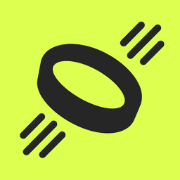

<p align="center">
  
</p>

<h1 align="center">Ekloop</h1>

<p align="center"><b>Your strap. Your data. Your machine. Offline, on-device, no cloud.</b></p>

<p align="center">
  
  
  
  <a href="LICENSE"></a>
</p>

---

## This is a fork

**Ekloop is a fork of [NOOP](https://github.com/ryanbr/noop) by [@ryanbr](https://github.com/ryanbr).**
Every line of the engine — the WHOOP BLE protocol work, the analytics, the storage
layer, the Android app — is theirs. This fork exists so the Ekklo team can run the
app under a name of our own and try UI ideas on the macOS target; it is not a
competing project and it is not more current than upstream.

**For the current code, releases and community, go upstream:**
**[github.com/ryanbr/noop](https://github.com/ryanbr/noop)** ·
[r/NoopBand](https://www.reddit.com/r/NoopBand/) ·
[Discord](https://discord.com/invite/wKgyqVdjrP)

Upstream asks two things of anyone who forks, and this fork honours both: keep it
non-commercial with the [`LICENSE`](LICENSE) and `Copyright 2026 NoopApp` notice
intact, and point people back to the canonical home. Read the upstream
[README](https://github.com/ryanbr/noop#readme) for what the app actually does — the
feature list, strap support, architecture and privacy model all live there and are
not duplicated here to avoid drifting out of date.

---

## What is different here

| | Upstream NOOP | Ekloop |
|---|---|---|
| Displayed app name | NOOP | **Ekloop** |
| Icon | NOOP mark | Ekklo-derived mark, brand lime `#DCFF50` on `#262626` |
| Bundle ids, package names, `.noopbak` | unchanged | **unchanged** — backups stay interchangeable with upstream and with the Android app |

Nothing in the engine is forked: no protocol, analytics, storage or scoring change.
Keeping the identifiers untouched is deliberate, so pulling upstream fixes stays a
plain `git merge` rather than a conflict on every rename.

## Who this is for

The Ekklo team, on our own WHOOP straps, for our own data. That is a personal,
non-commercial use — which is what the licence permits. If this ever becomes part of
something the company sells or ships to customers, the licence does not cover it and
the question has to be reopened before, not after.

---

## Quickstart (macOS)

**Requirements:** macOS 13+, Xcode 15+ (Swift 5.9), and a Mac with Bluetooth. To pair
live you need your own WHOOP strap; to just explore, import a CSV or Apple Health
export instead.

The Xcode project is generated from [`project.yml`](project.yml) with
[XcodeGen](https://github.com/yonaskolb/XcodeGen) — never hand-edit `Strand.xcodeproj`.

```bash
# 1. Clone
git clone https://github.com/ekklosaas/ekkloop.git Ekloop
cd Ekloop

# 2. (Re)generate the Xcode project from project.yml
brew install xcodegen   # if you don't have it
xcodegen generate

# 3. Open and run
open Strand.xcodeproj
# Select the "Strand" scheme → Run (⌘R). The built app is named Ekloop.
```

The packages also build on their own, with no Xcode and no strap:

```bash
cd Packages/WhoopProtocol && swift build && swift test
```

## Staying in sync with upstream

```bash
git remote add upstream https://github.com/ryanbr/noop.git   # once
git fetch upstream
git merge upstream/main
```

Upstream is active — WHOOP 5.0 sync fixes land there regularly — so pull often. The
only file that should ever conflict is this README.

---

## Licence, attribution and disclaimer

Ekloop inherits all three from NOOP, unchanged:

- **Licence:** [PolyForm Noncommercial 1.0.0](LICENSE). Free for personal and other
  non-commercial use. Commercial use is **not** granted.
- **Attribution:** the protocol work this rests on is credited in
  [`ATTRIBUTION.md`](ATTRIBUTION.md) — notably `johnmiddleton12/my-whoop` (WHOOP 4.0
  BLE) and `b-nnett/goose` (WHOOP 5.0 / MG BLE).
- **Disclaimer:** [`DISCLAIMER.md`](DISCLAIMER.md). This is an independent,
  unofficial interoperability project, **not affiliated with, endorsed by, or
  connected to WHOOP, Inc.** References to "WHOOP" are nominative, identifying the
  third-party hardware the app talks to.

**Not a medical device.** Heart rate, HRV, recovery, strain, sleep stages, SpO₂,
respiratory rate and skin temperature are **approximations** computed on-device from
published methods. They are not clinically validated, they are not WHOOP's official
scores, and they are not medical advice. Provided as-is, with no warranty, for
personal use, at your own risk.

## Docs

The full documentation is upstream's and is carried here unchanged:

- [`AGENTS.md`](AGENTS.md) — the contributor map: architecture, the cross-platform
  parity contract, what CI does and does not cover.
- [`docs/CONTRIBUTING.md`](docs/CONTRIBUTING.md) — BLE safety contract, design-system
  rules, recipes.
- [`docs/BUILD.md`](docs/BUILD.md) — signing and pairing · [`docs/IOS.md`](docs/IOS.md) — the iOS target.
- [`CHANGELOG.md`](CHANGELOG.md) — release history.
